# **AWS -DOCKER - APPIFAST**

|**Status**|**Implemented** |\
|**Author(s)**|**Johan Aranda**|\
|**Repository**|**GitHub**|\
|**Updated**|**13-06-2023 / 14-07-2023**|

## **Objective**

Implementar una infraestructura básica, donde el usuario ingrese a la aplicación por medio de internet y lo reciba el ALB (Application Load Balancer) para que sea distribuido de manera automática configurado desde terraform.

la aplicación será implementada con FastAPI que a su vez se encontrará en Docker en una EC2, tendrá unas herramientas de metodologías de integración por medio de CI/CD de GitLab todo establecido desde terraform.

Este código será almacenado en los repositorios de GitHub.

## **Motivation**

Adquirir nuevos conocimientos, practicar y obtener experiencia.

## **User Benefit**

Aumentará mi aprendizaje y experiencia.

## **Design Proposal**

Definimos la arquitectura de la aplicación.
será realizada desde un web framework FastAPI que manejan anotaciones de tipos estándar de Python.

### Crear la imagen de Docker

* definiremos un archivo dockerfile para construir una imagen de Docker para la aplicación, incluyendo todas las dependencias necesarias para la aplicación.

### Configurar un clúster de EC2

* Utilizamos terraform para definir y crear una instancia de EC2.
* Especificaremos los tipos de instancias, el tamaño según la necesidad de nuestra aplicación.
* Configuraremos las reglas de seguridad para permitir el trafico necesario hacia la instancia de EC2.

### Configurar el balanceador de carga

* Utilizaremos Terraform para la creación de un balanceador de carga Application Load Balancer (ALB)
* Configurar el balanceador de carga y enrutar el tráfico hacia las instancias del EC2.

### Despliegue de la aplicación

* Utilizaremos Terraform para desplegar las instancias de Ec2 utilizado la imagen de Docker creada anterior mente.
* Configurar las variables para que la ejecución de la aplicación funcione correctamente.

## **Cost Implications**

0%.

## **Dependencies**

El proyecto no tienen ninguna dependencia.

## **Platforms and Environments**

* El Proyecto funcionara en todas las plataformas
* Como entornos de ejecución tendrá servicio en la nube

## **Best Practices**

Será realizada de manera automatizada para mejorar la práctica de uso.

## **Compatibility**

Cumple con la compatibilidad de Python.

## **User Impact**

Como cliente, quiero el funcionamiento de la aplicación de la manera más fluida.

## **Detailed Design**

## Código para crear la instancia en AWS con Terraform.(main.tf)

    variable "ssh_key_path" {}
    variable "vpc_id" {}

    provider "aws" {
    region = "us-east-1"
    }

    resource "aws_instance" "example" {
      ami           = "ami-0c94855ba95c71c99"
      instance_type = "t2.micro"

    tags = {
      Name = "mi-instancia"
    }
    }

    resource "aws_key_pair" "deployer" {
      key_name   = "deployer-key"
      public_key = file(var.ssh_key_path)
      }

    resource "aws_security_group" "allow_ssh" {
      name        = "allow_ssh"
      description = "Allow SSH inbound traffic"
      vpc_id      = var.vpc_id

      ingress {
        description = "SSH from VPC"
        from_port   = 22
        to_port     = 22
        protocol    = "tcp"
        cidr_blocks = ["0.0.0.0/0"]
      }

      ingress {
        description = "HTTP from VPC"
        from_port   = 80
        to_port     = 80
        protocol    = "tcp"
        cidr_blocks = ["0.0.0.0/0"]
      }

      egress {
        from_port   = 0
        to_port     = 0
        protocol    = "-1"
        cidr_blocks = ["0.0.0.0/0"]
      }

      tags = {
        Name = "allow_ssh"
      }
    }

    resource "aws_instance" "web" {
      ami                    = aws_instance.example.ami
      instance_type          = "t2.micro"
      key_name               = aws_key_pair.deployer.key_name
      vpc_security_group_ids = [aws_security_group.allow_ssh.id]

      tags = {
        Name = "HelloWorld"
      }
      }

    output "ip_instance" {
      value = aws_instance.example.public_ip
    }

    output "ssh" {
      value = "ssh -l ec2-user ${aws_instance.example.public_ip}"
    }

    resource "aws_lb_target_group" "WEBFastApi" {
      name     = "My-target-group"
      port     = 80
      protocol = "HTTP"
      vpc_id   = var.vpc_id

      health_check {
        path                = "/"
        protocol            = "HTTP"
        port                = "traffic-port"
        interval            = 30
        healthy_threshold   = 3
        unhealthy_threshold = 3
        timeout             = 6
      }
    }

    resource "aws_lb" "alb_fastapi" {
      name               = "my-load-balancer"
      internal           = false
      load_balancer_type = "application"
      subnets            = ["subnet-034ce95c3b7f30823","subnet-0243e7b43abe3d20e"]  # Reemplaza con los IDs de tus subnets
      security_groups    = [aws_security_group.allow_ssh.id]

      tags = {
        Name = "My_load_balancer"
      }
     }

    resource "aws_lb_listener" "example" {
      load_balancer_arn = aws_lb.alb_fastapi.arn
      port              = 80
      protocol          = "HTTP"

      default_action {
        type             = "forward"
        target_group_arn = aws_lb_target_group.WEBFastApi.arn
      }
    }

## **Variables. (terraform.tfvars)**

    ssh\_key\_path="/home/johan/iac/terraform-examples/aws/01\_simple\_vps/keys/practica.pub"

    vpc\_id="vpc-075e6ffee5456f6da"

## **keys.**

 Se crearon las llaves publicas y privaras para poder conectar con la instancia de AWS, la cual se almacenaron en una carpeta y que son llamadas desde el documento terraform.tfvars que a su vez es llamado desde el documento main.tf en la línea 18.

 

## Inicialización de instancia desde la terminal con terraform

Con _terraform plan_ tenemos una visualización de que todo este funcionando y que se creara en cada una de las instancias.

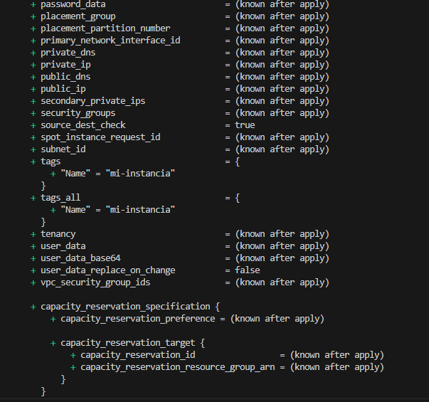

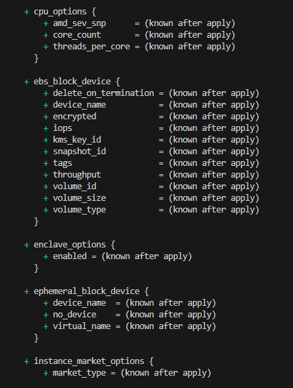
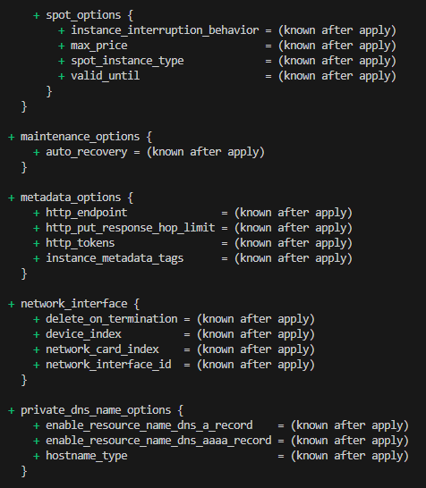
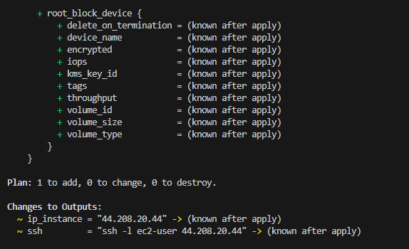

Con _terraform apply_ creamos los recursos antes vistos.

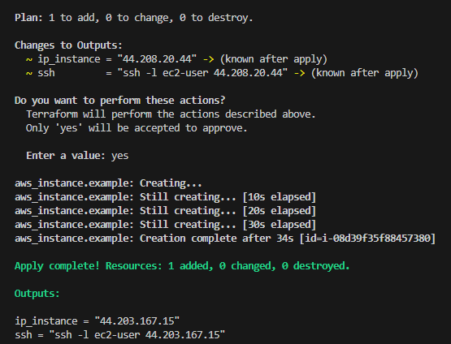

## Conectándonos a la instancia

    _root@LAPTOP-32406NRU:/home/johan/iac/terraform-examples/aws/01\_simple\_vps# ssh -i /home/johan/iac/terraform-examples/aws/01\_simple\_vps/keys/practica ec2-user@52.70.44.207_
    

## Instalamos los paquetes del sistema con el comando

_sudo yum update_

una vez instalados, verificamos con el código.

_sudo yum list installed_

para que nos de una lista de los paquetes instalados en la instancia ec2.

## Instalación de Docker en la ec2

* Ejecutamos el siguiente comando para asegurarnos que tenemos los últimos paquetes disponibles

          sudo yum update -y

* Utilizamos el siguiente comando para la instalación de Docker:

          sudo yum install -y Docker

* Iniciamos el servicio de Docker.

        _sudo service docker start_

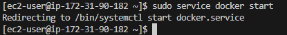

* Para poder visualizar la versión de Docker que tenemos instalado.

         Sudo docker –versión

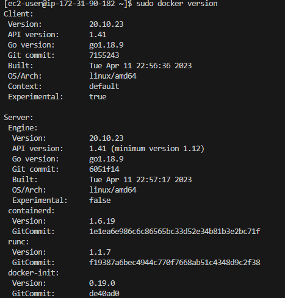

## ***FastAPI en el contenedor de DOCKER***

Preparamos la aplicación y que funcione en la maquina local

* main.py

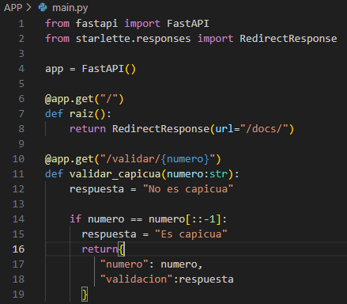

* Dockerfile

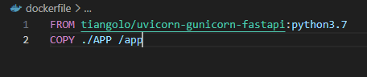

* revisamos nuestro puerto 80

## Subir la FASTAPPI a la ec2 de amazon

 De nuestro ordenador local realizamos un Git y creamos un repositorio en GitHub para de esta manera clonarlo desde GitHub a nuestra maquina ec2.
 Para así ya tene  nuestro archivo en la ec2, tuve que descargar git en la ec2 para poder que los comandos funcionen.

* MAQUINA LOCAL

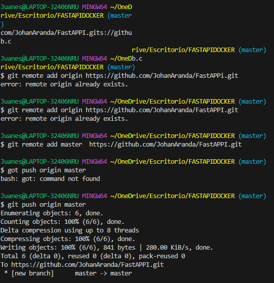

## EC2 DE AMAZON

* clonando el archivo desde GitHub a nuestra ec2.

## Creación de la imagen de Docker

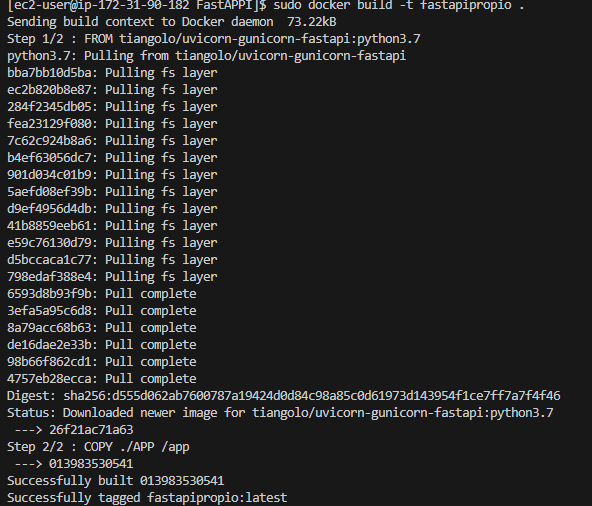

* despliegue de contenedor.

* Cuando ya tenemos generado el ID del contenedor podemos corroborar que este corriendo en el puerto 80 con nuestra dirección IP publica.

## Creación de servicios ALB (aplication load balancer) con terraform

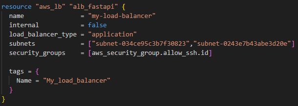

## Target groups

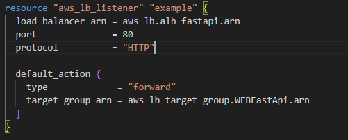

Para corroborar que funcione, tomamos el DNS Name del balanceador de carga y lo abrimos.

      my-load-balancer-398867340.us-east-1.elb.amazonaws.com

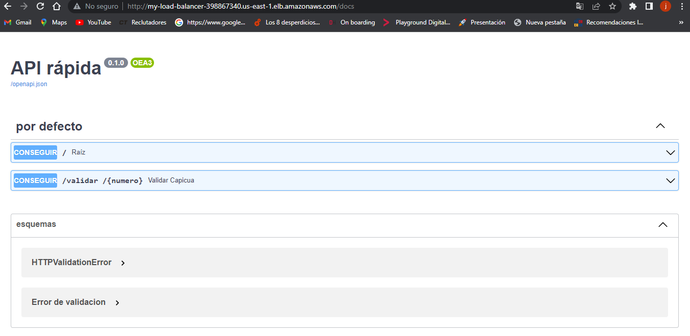.

